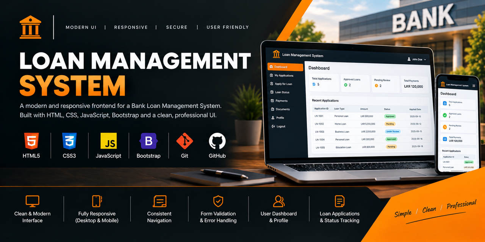

# 🏦 Loan Management System — Frontend

A web-based frontend for a **Bank Loan Management System**, providing dedicated interfaces for customers and banking staff to interact with loan management workflows.

The frontend is built using **HTML5, CSS3, JavaScript, and Bootstrap** and communicates with a Java-based REST API backend.

> **Project focus:** JavaScript • REST API Integration • Banking UI • Authentication Workflows • Responsive Web Development

---

## 📌 Overview

The frontend provides role-oriented interfaces for different parts of the loan management lifecycle.

Customers can submit and track loan applications, view loan information, make payments, and upload loan documents.

Authorized staff can manage customers, users, staff records, loan applications, application reviews, loans, payments, and related documents.

The application uses JavaScript to communicate with the backend REST APIs and dynamically display and manage application data.

---

## ✨ Key Features

### 👤 Customer Portal

* Customer dashboard
* Customer profile management
* Customer registration
* Loan application submission
* View personal loan applications
* View loan application details
* View loans
* Make loan payments
* View payment history
* Upload loan documents

### 🏦 Staff & Administrative Functions

* Customer management
* Staff management
* User management
* Loan application management
* Loan application review
* Application status updates
* Loan management
* Payment management
* Loan document management

### 🔐 Authentication

* Login interface
* OTP verification interface
* JWT authentication integration
* Token-based API requests
* Role-based interface access

> **Note:** Authorization is enforced by the backend API. The frontend provides the corresponding interfaces and authentication integration.

---

## 🛠️ Technology Stack

| Technology          | Purpose                                 |
| ------------------- | --------------------------------------- |
| **HTML5**           | Web page structure                      |
| **CSS3**            | Custom application styling              |
| **Bootstrap 5.3.3** | Responsive UI components                |
| **JavaScript**      | Application logic and API communication |
| **REST API**        | Backend communication                   |
| **JWT**             | Authentication integration              |
| **Eclipse IDE**     | Development environment                 |

---

## 🖥️ Application Preview



## 🏗️ Application Architecture

The frontend communicates with the backend through REST APIs.

```text
┌─────────────────────────────┐
│       Customer / Staff      │
│          Browser            │
└──────────────┬──────────────┘
               │
               ▼
┌─────────────────────────────┐
│       HTML / Bootstrap      │
│             UI              │
└──────────────┬──────────────┘
               │
               ▼
┌─────────────────────────────┐
│         JavaScript          │
│     Application Logic       │
└──────────────┬──────────────┘
               │
               │ REST / HTTP
               ▼
┌─────────────────────────────┐
│     Java Backend API        │
│   Jakarta EE / JAX-RS       │
└──────────────┬──────────────┘
               │
               ▼
┌─────────────────────────────┐
│        PostgreSQL           │
└─────────────────────────────┘
```

JavaScript is responsible for tasks such as:

* Sending REST API requests
* Handling authentication tokens
* Processing API responses
* Populating HTML elements with returned data
* Handling forms
* Managing user interactions
* Displaying application and payment information

---

## 📂 Project Structure

```text
LoanApplication-Frontend/
├── screenshots/
│	└── front.png
└── src/
    └── main/
        └── webapp/
            ├── assets/
            │
            ├── css/
            │   ├── style.css
            │   └── stylecus.css
            │
            ├── customer/
            │   ├── customer-dashboard.html
            │   ├── customer-profile.html
            │   ├── customer-loan-view.html
            │   ├── loan-application.html
            │   ├── my-loan-applications.html
            │   ├── my-loans.html
            │   ├── my-payments.html
            │   └── make-payment.html
            │
            ├── js/
            │   ├── auth.js
            │   ├── customer.js
            │   ├── customer-dashboard.js
            │   ├── apply-loan.js
            │   ├── my-loan-applications.js
            │   ├── my-loans.js
            │   ├── my-payments.js
            │   └── ...
            │
            ├── pages/
            │   ├── dashboard.html
            │   ├── login.html
            │   ├── otp.html
            │   ├── loan-application.html
            │   ├── loan-application-details.html
            │   ├── loan-application-review.html
            │   ├── customer.html
            │   ├── staff.html
            │   ├── users.html
            │   ├── loan.html
            │   ├── payment.html
            │   ├── upload-document.html
            │   └── ...
            │
            ├── WEB-INF/
            │   ├── lib/
            │   └── web.xml
            │
			│
            └── index.html
```

Additional HTML and JavaScript files may be present but are omitted from the structure above for readability.

---

## 🔗 Backend Integration

The frontend communicates with the Java backend using REST APIs.

### Backend Technologies

* Java 17
* Jakarta EE
* Jakarta REST (JAX-RS)
* Hibernate ORM
* JPA
* PostgreSQL
* JWT authentication

JavaScript sends HTTP requests to the backend and processes the returned JSON data.

For example, authenticated API requests use a JWT bearer token:

```http
Authorization: Bearer <your-jwt-token>
```

The frontend and backend are maintained as separate repositories.

### Related Backend Repository

https://github.com/joesh91/Loan-Application-System.git

---

## 🚀 Getting Started

### Prerequisites

The following are required:

* JDK 17
* Eclipse IDE for Enterprise Java and Web Developers, or another compatible IDE
* WildFly application server
* PostgreSQL
* The corresponding Loan Management System backend

### Setup

#### 1. Clone the Repository

```bash
git clone https://github.com/joesh91/LoanApplication-Frontend.git
```

#### 2. Import the Project

Import the project into Eclipse as an existing project.

#### 3. Configure the Backend

Make sure the corresponding Loan Management System backend is configured and running.

Refer to the backend repository for:

* PostgreSQL database setup
* Backend configuration
* WildFly deployment
* REST API configuration

#### 4. Configure the API URL

Verify that the JavaScript files use the correct backend API base URL for your local environment.

#### 5. Deploy the Application

Configure the appropriate WildFly runtime and deploy the frontend application.

#### 6. Open the Application

Access the application through the URL provided by your WildFly deployment.

> **Important:** The backend API URL, WildFly configuration, and any required CORS configuration must match your local environment.

---

## 🎨 User Interface

The application follows a consistent banking-inspired interface designed around:

* Dark navigation elements
* Structured page layouts
* Responsive Bootstrap components
* Reusable CSS styling
* Customer-oriented dashboards
* Staff management interfaces
* Loan application and review pages
* Payment and document management interfaces

The UI focuses on maintaining a consistent experience across customer and staff workflows.

### Screenshots

Screenshots can be added here to demonstrate the main application workflows.

Suggested screenshots include:

* Login
* Customer dashboard
* Loan application
* My loan applications
* Loan application details
* Application review
* Loan management
* Payment management

---

## 🎯 Frontend Concepts Demonstrated

This project provided practical experience with:

* HTML5 page development
* CSS3 styling
* Bootstrap responsive design
* JavaScript application logic
* DOM manipulation
* Form handling
* REST API integration
* JSON data handling
* JWT authentication integration
* Token-based API requests
* Dynamic data rendering
* Customer and staff workflows
* Full-stack frontend/backend integration

---

## 🔗 Project Repositories

### Backend

https://github.com/joesh91/Loan-Application-System.git

### Frontend

https://github.com/joesh91/LoanApplication-Frontend.git

---

## 👨‍💻 About This Project

The Loan Management System frontend was developed as part of a full-stack banking application to gain practical experience with **JavaScript, REST API integration, authentication workflows, responsive web development, and frontend/backend integration**.

It provides dedicated customer and staff interfaces for managing different stages of the loan lifecycle.

**Project:** Loan Management System
**Component:** Frontend
**Domain:** Banking & Financial Services
**Frontend:** HTML5 / CSS3 / JavaScript / Bootstrap
**Backend:** Java 17 / Jakarta EE / REST API
**Status:** Core Features Implemented
